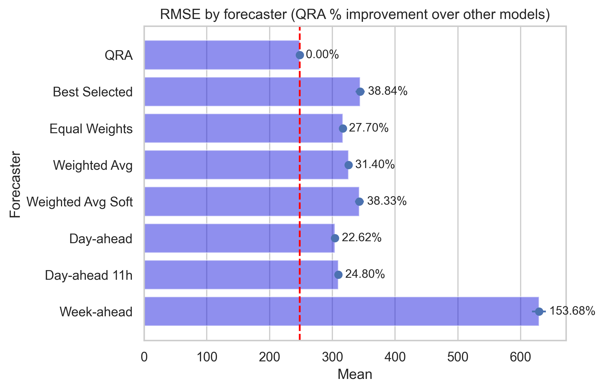
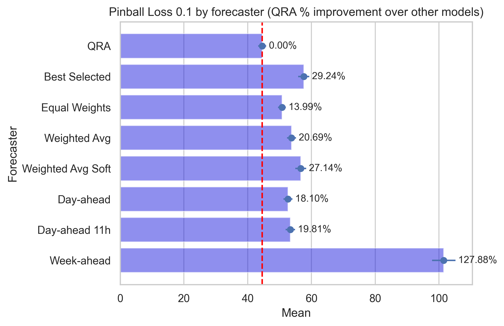
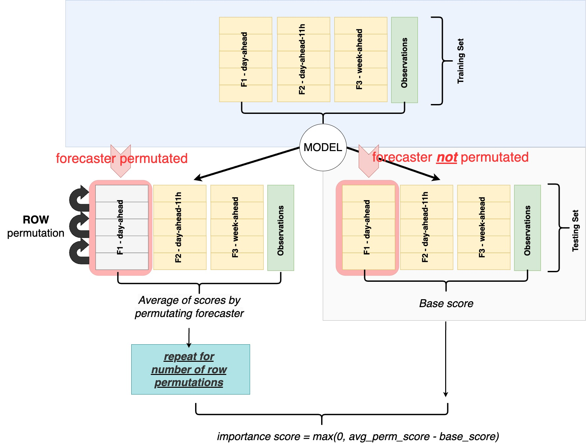

# PREDICO: Collaborative Forecasting Through a Data Analytics Marketplace

## Table of Contents

0. [Introducing PREDICO Platform](#0-introducing-predico-platform)
1. [Overview](#1-overview)
2. [Collaborative Forecasting Modules](#2-collaborative-forecasting-modules)
    - 2.0. [Dataset](#20-dataset)
    - 2.1. [Probabilistic Forecasting Module](#21-probabilistic-forecasting-module)
    - 2.2. [Wind Ramp Detection Module](#22-wind-ramp-detection-module)
    - 2.3. [Contribution Assessment Module](#23-contribution-assessment-module)
3. [Installation](#3-installation)
4. [Usage](#4-usage)
5. [Configuration](#5-configuration)
6. [Contributing](#6-contributing)
7. [License](#7-license)
8. [Contact](#8-contact)

## 0. Introducing PREDICO Platform

PREDICO is a platform for collaborative forecasting, designed to enhance forecasting accuracy through collaboration between market makers and forecasters. This repository includes the methodology, learning algorithms, and evaluation tools necessary to combine forecasts and progress toward building a fully functional data marketplace.

* #### Join PREDICO Collaborative Forecasting Sessions
    Explore the PREDICO platform and service documentation to join the daily collaborative forecasting sessions at https://predico-elia.inesctec.pt/.

* #### Setting up PREDICO platform
    For detailed instructions on setting up and deploying the PREDICO platform in operational environments, refer to the following repository: https://github.com/INESCTEC/predico-collabforecast.

## 1. Overview

The collaborative forecasting process is divided into three main components, as shown in the diagram below. 

## 2. Collaborative Forecasting Modules

The following detailed flowchart illustrates the main steps in wind energy forecasting and wind energy variability, together with the evaluation of the contributions of the various forecasters.

* **Probabilistic Forecasting Module**: This module is divided into two chained processes:

    * **Wind Power Submodule**: Forecasts are generated through standard statistical learning steps including feature engineering, hyperparameter optimization, model training, and the final forecast generation.

    * **Wind Power Variability Submodule**: A similar process is followed here, focusing on capturing fluctuations in wind power output.

* **Wind Ramp Detection Module**: This module identifies sudden changes or "ramps" in wind power, which are essential for maintaining power grid stability and supporting effective decision-making.

* **Contribution Assessment Module**: This module utilizes methodologies such as Permutation Importance and Shapley Values to evaluate the contributions of forecasters' inputs. These methods help identify the most relevant variables in the forecasting task while promoting transparency in the evaluation.

### 2.0. Dataset

### 2.1. Probabilistic Forecasting Module
#### Methodology
**Quantile Regression Averaging (QRA) model**: The method involves applying quantile regression to a pool of forecasts of individual (i.e., not combined) forecasting models. It offers the advantage to directly work with the distribution of the wind power without the need to split the probabilistic forecast into a point forecast and the distribution of the error term.

#### Evaluation over a 3-year period

#### Performance metrics: RMSE, Pinball loss, Coverage, and Sharpness
When evaluating a probabilistic forecast, the main challenge is that we never observe the true distribution of the underlying process. Over the years, a number of ways have been developed to evaluate probabilistic forecasts. Some methods admit formal statistical tests, while other result in a single number which has a clear interpretation and is easy to compare.

* **The Root Mean Squared Error (RMSE)**
* **The Pinball loss** is a special case of an asymmetric piecewise linear loss function. It is a proper scoring rule designed to provide a summary measure for the
evaluation of probabilistic forecasts by assigning a numerical score based on the predictive distribution and on the actually
observed wind power.
* **Winkler score (TODO)**

  

    
  

  

    
  

  

    
  

* **Reliability** (also called calibration or unbiasedness) refers to the statistical consistency between the distributional forecasts and the
observations. For instance, if a 80% Prediction Interval (PI) covers 80% of the observed wind power, then this PI is said to be reliable, well calibrated, or unbiased.

* **Sharpness** refers to how tightly the predicted distribution covers the actual one, i.e., to the concentration of the predictive distributions.

  

    
  

  

    
  

#### The frequency at which QRA outperforms other models

  

    
  

  

    
  

  

    
  

#### Post-hoc Nemenyi test 

  

    
  

  

    
  

  

    
  

### 2.2. Wind Ramp Detection Module
#### Methodology
#### Evaluation

### 2.3. Contribution Assessment Module

**PREDICO** exploits advanced techniques of Variable Importance Analysis, also known as Explainable AI, to meet the specific needs of evaluating the contributions of forecasters participating in the data market and to ensure appropriate allocation of payments.
The following methods to assess forecasters’ contributions:

* **Model coefficients (Permutation-based p-values)** (applied in-sample)
* **Shapley values or permutation importance** (applied out-of-sample)

These methods are implemented to address two critical objectives:

* **Enhancing user trust**: Encouraging forecaster engagement.
* **Model debugging and refinement**: Interpreting and improving the forecasts combination mechanism.

##
### Permutation Importance

### Shapley Values Importance

It’s also important to remember the following:

* #### A forecaster considered to have low importance in a poorly performing model might be crucial for a high-performing model. 
* #### Contribution score doesn't indicate the intrinsic predictive value of a forecaster on its own but rather how significant that forecaster is to a specific model. 

    

## 3. Installation
## 4. Usage
## 5. Configuration
## 6. Contributing
## 7. License

This project is licensed under the AGPL v3 license - see the [LICENSE](./LICENSE) file for details.

## 8. Contact

Contributors:

* Giovanni Buroni giovanni.buroni@inesctec.pt
* Carla Gonçalves carla.s.goncalves@inesctec.pt
* José Andrade jose.r.andrade@inesctec.pt
* André Garcia andre.f.garcia@inesctec.pt
* Ricardo Bessa ricardo.j.bessa@inesctec.pt

If you have any questions regarding the methodology, please contact:
* Giovanni Buroni giovanni.buroni@inesctec.pt

