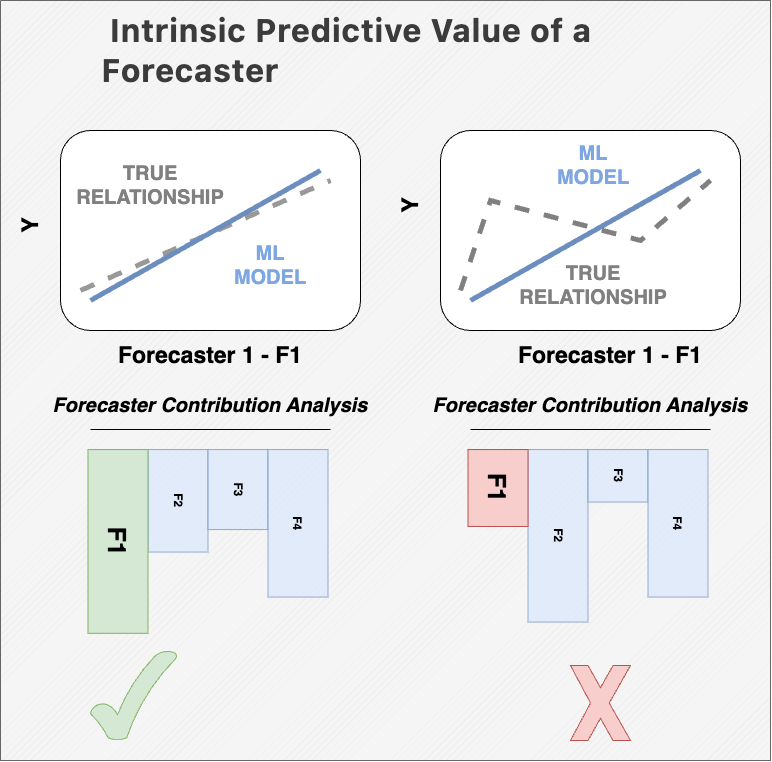

# PREDICO: Collaborative Forecasting Through a Data Analytics Marketplace

PREDICO is a platform for collaborative forecasting, designed to enhance forecasting accuracy through collaboration between market makers and forecasters. This repository includes the methodology, learning algorithms, and evaluation tools necessary to combine forecasts and progress toward building a fully functional data marketplace.

* #### Join PREDICO Collaborative Forecasting Sessions
    Explore the PREDICO platform and service documentation to join the daily collaborative forecasting sessions at https://predico-elia.inesctec.pt/.

* #### Setting up PREDICO platform
    For detailed instructions on setting up and deploying the PREDICO platform in operational environments, refer to the following repository: https://github.com/INESCTEC/predico-collabforecast.

## Overview

The collaborative forecasting process is divided into three main components, as shown in the diagram below. 

## Collaborative Forecasting Modules

The following detailed flowchart illustrates the main steps in wind energy forecasting and wind energy variability, together with the evaluation of the contributions of the various forecasters.

* **Probabilistic Forecasting Module**: This module is divided into two chained processes:

    * **Wind Power Submodule**: Forecasts are generated through standard statistical learning steps including feature engineering, hyperparameter optimization, model training, and the final forecast generation.

    * **Wind Power Variability Submodule**: A similar process is followed here, focusing on capturing fluctuations in wind power output.

* **Wind Ramp Detection Module**: This module identifies sudden changes or "ramps" in wind power, which are essential for maintaining power grid stability and supporting effective decision-making.

* **Contribution Assessment Module**: This module utilizes methodologies such as Permutation Importance and Shapley Values to evaluate the contributions of forecasters' inputs. These methods help identify the most relevant variables in the forecasting task while promoting transparency in the evaluation.

    <h2>Contribution Assessment Module</h2>

**PREDICO** exploits advanced techniques of Variable Importance Analysis, also known as Explainable AI, to meet the specific needs of evaluating the contributions of forecasters participating in the data market and to ensure appropriate allocation of payments.
The following methods to assess forecasters’ contributions:

* **Model coefficients (Permutation-based p-values)** (applied in-sample)
* **Shapley values or permutation importance** (applied out-of-sample)

These methods are implemented to address two critical objectives:

* **Enhancing user trust**: Encouraging forecaster engagement.
* **Model debugging and refinement**: Interpreting and improving the forecasts combination mechanism.

##
### Permutation Importance

### Shapley Values Importance

It’s also important to remember the following:

* #### A forecaster considered to have low importance in a poorly performing model might be crucial for a high-performing model. 
* #### Contribution score doesn't indicate the intrinsic predictive value of a forecaster on its own but rather how significant that forecaster is to a specific model. 

    

### Contributions
* Giovanni Buroni giovanni.buroni@inesctec.pt
* Carla Gonçalves carla.s.goncalves@inesctec.pt
* José Andrade jose.r.andrade@inesctec.pt
* André Garcia andre.f.garcia@inesctec.pt
* Ricardo Bessa ricardo.j.bessa@inesctec.pt

### Contacts
If you have any questions regarding the methodology, please contact:
* Giovanni Buroni giovanni.buroni@inesctec.pt

